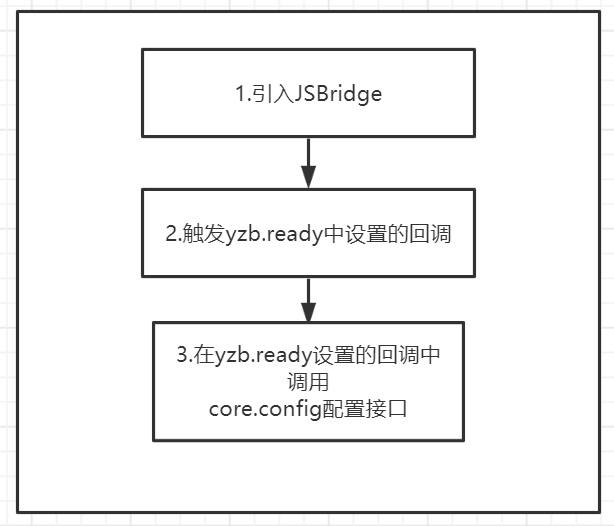

### 工作流程

> 请参照流程图



### 引入 js,注入对象

在`html`文件中`header`内引入`js bridge`

```html
<script src="https://static.yuanzhibang.com/app/open/js/bridge/js-yzb-bridge-v0.0.19.js"></script>
<script>
// 引入后设置ready回调
yzb.ready(
()=>{
    // 在回调中配置
    var configData = {};
    yzb.core.config(configData);
}
);
<script>
```

> 注入对象名为 yzb,所有方法和属性均在该注入对象上.

---

### 变量列表

!>所有版本号信息均为`0.0.0`格式,遵从`major.minor.patch`版本格式发布,`major`为重大更新版本包含`break change`,变动较大,调用过程需要注意.`minor`为小更新,无需关注 api 变更,仅添加 api,除非必要,不会对原有接口进行变更,`patch`仅仅进行`bug`修复.

| 变量名称           | 描述                                                                     |
| ------------------ | ------------------------------------------------------------------------ |
| `version`          | 获取当前注入`js bridge`的版本号                                          |
| `appVersion`       | 获取桌面端应用的版本号                                                   |
| `containerVersion` | 获取桌面端容器的版本号,一般所有接口和该值相关,有更新也会更新该容器版本号 |

**示例**

```javascript
var containerVersion = yzb.containerVersion;
```

---

### API 列表

!> 需要验证的原则,一个是会影响页面操作,一个是会有安全疑虑.

| 命名空间     | 方法名称                    | 是否需要`config`验证 | 使用弹出窗口用户确认 | 描述                                                |
| ------------ | --------------------------- | -------------------- | -------------------- | --------------------------------------------------- |
| core         | `core.config`               | 否                   | 否                   | 用来注入页面配置信息,开启`debug`以及验证`jsApi`     |
| core         | `core.requestAuthCode`      | 是                   | 否                   | 获取免登陆`code`的 js 方法                          |
| core         | `core.requestAccess`        | 是                   | 否                   | 配置验证上述需要验证的`js`方法,并获取`open_id`      |
| app          | `app.close`                 | 是                   | 否                   | 关闭容器页面                                        |
| app          | `app.setUrlOpenAction`      | 否                   | 否                   | 设置通过外部 url 打开应用将传入的完整 url 传给应用  |
| app          | `app.showModal`             | 是                   | 否                   | 打开 modal 窗口                                     |
| notification | `notification.vibrate`      | 是                   | 否                   | 晃动窗口                                            |
| preview      | `preview.showImage`         | 是                   | 是                   | 打开图片播放器                                      |
| preview      | `preview.showPDF`           | 是                   | 是                   | pdf 展示器                                          |
| setting      | `setting.set`               | 是                   | 否                   | 设置应用配置                                        |
| setting      | `setting.get`               | 是                   | 否                   | 获取应用配置                                        |
| setting      | `setting.remove`            | 是                   | 否                   | 移除应用配置                                        |
| native       | `native.run`                | 是                   | 是                   | 运行原生二进制程序                                  |
| native       | `native.stop`               | 是                   | 否                   | 停止运行的原生二进制程序                            |
| native       | `native.setCallback`        | 是                   | 否                   | 设置原生二进制程序各类消息回调                      |
| native       | `native.getProcessInfo`     | 是                   | 否                   | 获取进程信息                                        |
| native       | `native.sendProcessMessage` | 是                   | 否                   | 向进程发送原生`message`信息                         |
| native       | `native.getNativeInfo`      | 是                   | 否                   | 获取原生相关信息                                    |
| file         | `file.exist`                | 是                   | 否                   | 判断文件是否存在                                    |
| file         | `file.getFileHash`          | 是                   | 否                   | 获取文件的 hash 值                                  |
| file         | `file.getInfo`              | 是                   | 否                   | 获取文件/文件夹的信息                               |
| file         | `file.read`                 | 是                   | 是                   | 读取文件                                            |
| file         | `file.write`                | 是                   | 是                   | 写入文件                                            |
| file         | `file.mkdir`                | 是                   | 是                   | 创建目录                                            |
| file         | `file.remove`               | 是                   | 是                   | 移除文件/文件夹                                     |
| file         | `file.getAppHome`           | 是                   | 否                   | 获取应用数据目录                                    |
| file         | `file.showItemInFolder`     | 是                   | 否                   | 在文件管理器/Finder/其他文件管理器中显示文件/文件夹 |
| file         | `file.openPath`             | 是                   | 是                   | 打开文件夹或者文件                                  |
