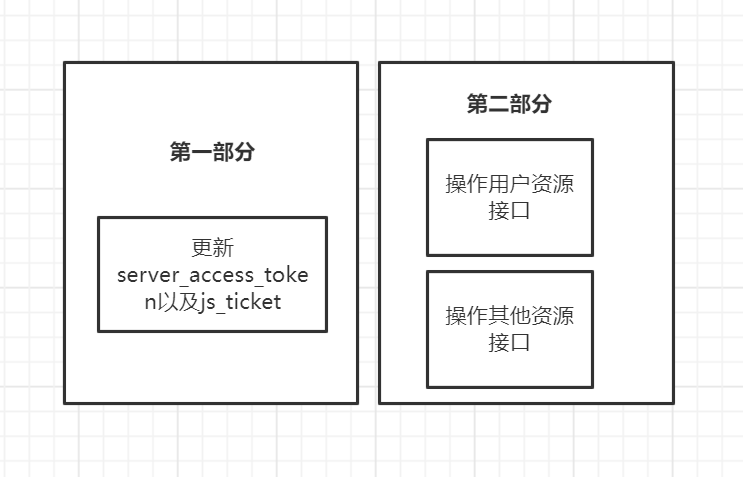

## 最佳实践
>提供最佳实践的方案供开发者参考

**1.将接口开发分为两个部分**
*****
### 第一部分:获取各种授权`token`等操作
>由于各种授权`token`会定时进行更新与获取，所以将此部分工作作为单独的部分进行开发，将各种授权的`token`存放在`redis` `mysql`等进行单独存储。以便于其他使用进行存取。

>[danger]请在开发加速中获取一键部署代码,支持`阿里云函数计算(FC)`以及docker方式快速一键部署.
---
### 第二部分:操作用户资源以及其他资源相关业务接口
>将此部分代码开发放置于业务代码，在需要使用各种授权`token`时候,从`redis` `mysql`等位置获取,这样可以保持授权token为最新状态.

