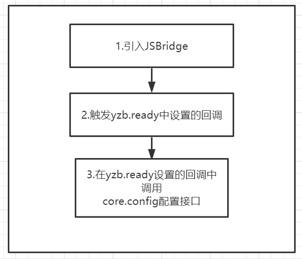

### 工作流程

> 請參照流程圖



### 引入 js,注入對象

在`html`文件中`header`內引入`js bridge`,最新版查看 [引入 Bridge 說明](zh-tw/open-app-develop/js-bridge-note)

```html
<script src="https://static.yuanzhibang.com/app/open/js/bridge/js-yzb-bridge-vx.x.x.js"></script>
<script>
// 引入後設置ready回調
yzb.ready(
()=>{
    // 在回調中配置
    var configData = {};
    yzb.core.config(configData);
}
);
<script>
```

> 注入對象名為 yzb,所有方法和屬性均在該注入對像上.

---

### 變量列表

!>所有版本號信息均為`0.0.0`格式,遵從`major.minor.patch`版本格式發布,`major`為重大更新版本包含`break change`,變動較大,調用過程需要注意.`minor`為小更新,無需關注 api 變更,僅添加 api,除非必要,不會對原有接口進行變更,`patch`僅僅進行`bug`修復.

| 變量名稱           | 描述                                                                     |
| ------------------ | ------------------------------------------------------------------------ |
| `version`          | 獲取當前註入`js bridge`的版本號                                          |
| `appVersion`       | 獲取桌面端應用的版本號                                                   |
| `containerVersion` | 獲取桌面端容器的版本號,一般所有接口和該值相關,有更新也會更新該容器版本號 |

**示例**

```javascript
var containerVersion = yzb.containerVersion;
```

---

### API 列表

!> 需要驗證的原則,一個是會影響頁面操作,一個是會有安全疑慮.

| 命名空間     | 方法名稱                    | 是否需要`config`驗證 | 使用彈出窗口用戶確認 | 描述                                               |
| ------------ | --------------------------- | -------------------- | -------------------- | -------------------------------------------------- |
| core         | `core.config`               | 否                   | 否                   | 用來注入頁面配置信息,開啟`debug`以及驗證`jsApi`    |
| core         | `core.requestAuthCode`      | 是                   | 否                   | 獲取免登陸`code`的 js 方法                         |
| core         | `core.requestAccess`        | 是                   | 否                   | 配置驗證上述需要驗證的`js`方法,並獲取`open_id`     |
| app          | `app.close`                 | 是                   | 否                   | 關閉容器頁面                                       |
| app          | `app.setUrlOpenAction`      | 否                   | 否                   | 設置通過外部 url 打開應用將傳入的完整 url 傳給應用 |
| app          | `app.showModal`             | 是                   | 否                   | 打開 modal 窗口                                    |
| notification | `notification.vibrate`      | 是                   | 否                   | 晃動窗口                                           |
| preview      | `preview.showImage`         | 是                   | 是                   | 打開圖片播放器                                     |
| preview      | `preview.showPDF`           | 是                   | 是                   | pdf 展示器                                         |
| setting      | `setting.set`               | 是                   | 否                   | 設置應用配置                                       |
| setting      | `setting.get`               | 是                   | 否                   | 獲取應用配置                                       |
| setting      | `setting.remove`            | 是                   | 否                   | 移除應用配置                                       |
| native       | `native.run`                | 是                   | 是                   | 運行原生二進製程序                                 |
| native       | `native.stop`               | 是                   | 否                   | 停止運行的原生二進製程序                           |
| native       | `native.setCallback`        | 是                   | 否                   | 設置原生二進製程序各類消息回調                     |
| native       | `native.getProcessInfo`     | 是                   | 否                   | 獲取進程信息                                       |
| native       | `native.sendProcessMessage` | 是                   | 否                   | 向進程發送原生`message`信息                        |
| native       | `native.getNativeInfo`      | 是                   | 否                   | 獲取原生相關信息                                   |
| file         | `file.exist`                | 是                   | 否                   | 判斷文件是否存在                                   |
| file         | `file.getFileHash`          | 是                   | 否                   | 獲取文件的 hash 值                                 |
| file         | `file.getInfo`              | 是                   | 否                   | 獲取文件/文件夾的信息                              |
| file         | `file.read`                 | 是                   | 是                   | 讀取文件                                           |
| file         | `file.write`                | 是                   | 是                   | 寫入文件                                           |
| file         | `file.mkdir`                | 是                   | 是                   | 創建目錄                                           |
| file         | `file.remove`               | 是                   | 是                   | 移除文件/文件夾                                    |
| file         | `file.getAppHom             |
